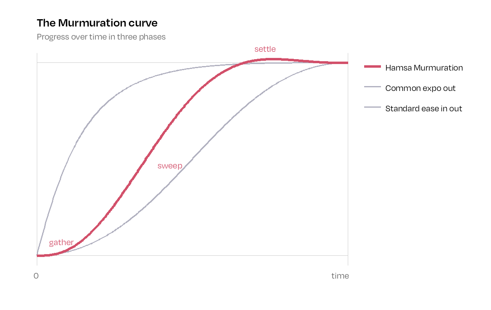

# Hamsa motion: the Murmuration curve

Hamsa has **one** easing curve. Every animation (web, product, video, slides) uses it, so Hamsa moves in a way you
can recognise. It's modelled on a murmuration of starlings, the brand's image of many things moving as one:

1. **Gather** (first ~15% of the time): an almost-still beat while everything draws together.
2. **Sweep** (to ~55%): a decisive, fast move, as one.
3. **Settle** (to the end): a 2% drift past the target at 76% of the time, then a soft return to rest.

Common curves either shoot off immediately ("expo out", used everywhere) or accelerate and brake symmetrically
("ease in out"). Neither has a hold at the start or a settle at the end, so the Murmuration curve looks and feels
distinct.



## The rules

1. **One curve in, its mirror out.** Things arriving use `--ease-hamsa`. Things leaving use `--ease-hamsa-exit`, the same
   curve played backwards: a tiny wind-up, then away.
2. **Four durations that double.** Pick by the size of what moves, never in between:

   | Token | Time | For |
   |---|---|---|
   | `--dur-1` | 200ms | Small and close: hover colours, links, icons, button fills |
   | `--dur-2` | 400ms | Components: menu items, tiles, the nav, icon morphs, colour fields, the menu swipe |
   | `--dur-3` | 800ms | Sections: reveals, panels, carousels |
   | `--dur-4` | 1200ms | Scenes: the largest moments (e.g. the asset circles assembling) |

3. **Exits run at 75% of the entry time** (leaving should never keep people waiting).
4. **Stagger by 30ms** (`--stagger`) when a group arrives one by one, in reading order.
5. **Scroll-driven animation** (where the scroll position drives the motion) maps each phase through the same curve
   (`hamsaEase()` in `site/src/lib/motion.ts`).
6. **Exceptions:** continuous loops, such as the scrolling client logos, run at constant speed (linear); and page
   scrolling uses its own smoothing (below), since it follows the visitor's hand rather than playing an animation.
7. **Reduced motion:** when someone has asked their device for less motion, skip movement and show the end state.

## Scroll feel

Page scrolling has a light drag, so the page glides and settles rather than jumping: [Lenis](https://github.com/darkroomengineering/lenis)
with `lerp: 0.1` (each frame the page covers 10% of the remaining distance; a flick settles in about one second).
Mouse wheel and trackpad only; touch scrolling stays native. Turned off for reduced motion, and paused while the menu
is open. Implemented in `site/src/lib/smooth-scroll.ts`.

## Values

### The curve's shape

The shape comes from this velocity profile, integrated and normalised so it runs from 0 to 1:

```
v(t) = t^1.8 × (1 − t)^2.0 × (0.76 − t)
```

| Time | 10% | 20% | 35% | 50% | 55% | 76% | 100% |
|---|---|---|---|---|---|---|---|
| Progress | 3% | 16% | 50% | 82% | 90% | 102% (peak) | 100% |

### CSS (web)

```css
--ease-hamsa: linear(0, 0.0004, 0.0028, 0.0082, 0.0173, 0.0308, 0.0486, 0.0709, 0.0976, 0.1284, 0.1631, 0.2012, 0.2422, 0.2858, 0.3313, 0.3783, 0.4263, 0.4746, 0.5228, 0.5704, 0.6169, 0.662, 0.7052, 0.7463, 0.7848, 0.8206, 0.8535, 0.8834, 0.9101, 0.9336, 0.954, 0.9712, 0.9855, 0.9969, 1.0057, 1.0121, 1.0163, 1.0186, 1.0193, 1.0187, 1.0171, 1.0149, 1.0122, 1.0094, 1.0068, 1.0044, 1.0025, 1.0012, 1.0004, 1.0001, 1);
--ease-hamsa-exit: linear(0, -0.0001, -0.0004, -0.0012, -0.0025, -0.0044, -0.0068, -0.0094, -0.0122, -0.0149, -0.0171, -0.0187, -0.0193, -0.0186, -0.0163, -0.0121, -0.0057, 0.0031, 0.0145, 0.0288, 0.046, 0.0664, 0.0899, 0.1166, 0.1465, 0.1794, 0.2152, 0.2537, 0.2948, 0.338, 0.3831, 0.4296, 0.4772, 0.5254, 0.5737, 0.6217, 0.6687, 0.7142, 0.7578, 0.7988, 0.8369, 0.8716, 0.9024, 0.9291, 0.9514, 0.9692, 0.9827, 0.9918, 0.9972, 0.9996, 1);
```

`linear()` works in all current browsers (Chrome/Edge 113+, Safari 17.2+, Firefox 112+). For older browsers and for
tools that only accept a Bézier curve, use the closest four-number approximation:

- Enter: `cubic-bezier(0.4, 0.02, 0.2, 1.06)`
- Exit: `cubic-bezier(0.8, -0.06, 0.6, 0.98)`

### JavaScript

`site/src/lib/motion.ts` exports `hamsaEase(t)` and `hamsaEaseExit(t)` (the same curve, sampled at 101 points).

### Figma, After Effects, Lottie, video

- **Figma prototypes:** Custom Bézier `0.4, 0.02, 0.2, 1.06`.
- **After Effects / Lottie:** keyframe to the table below (progress at every 5% of the duration), or use the Bézier values.

| t | 0 | .05 | .10 | .15 | .20 | .25 | .30 | .35 | .40 | .45 | .50 |
|---|---|---|---|---|---|---|---|---|---|---|---|
| p | 0.000 | 0.005 | 0.031 | 0.084 | 0.163 | 0.264 | 0.378 | 0.499 | 0.617 | 0.726 | 0.821 |

| t | .55 | .60 | .65 | .70 | .75 | .80 | .85 | .90 | .95 | 1 |
|---|---|---|---|---|---|---|---|---|---|---|
| p | 0.897 | 0.954 | 0.992 | 1.012 | 1.019 | 1.017 | 1.011 | 1.004 | 1.001 | 1.000 |

## Where it's used on the site

Every transition uses these tokens: nav fold (exit when hiding, enter when returning), menu swipe (400ms enter, 300ms
exit), menu items (400ms, 30ms stagger), hamburger → X morph, application tiles, stats reveal (800ms), platform stack,
team carousel (800ms), asset circles (1200ms), buttons and links (200ms), and the scroll-driven flock sequence.
