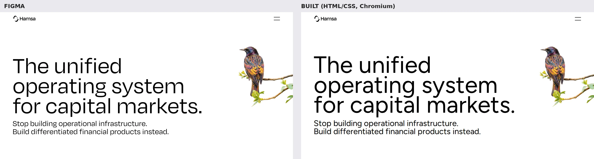
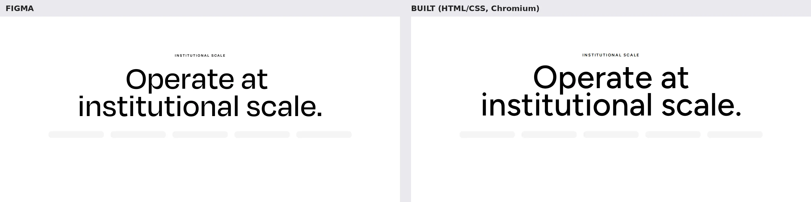
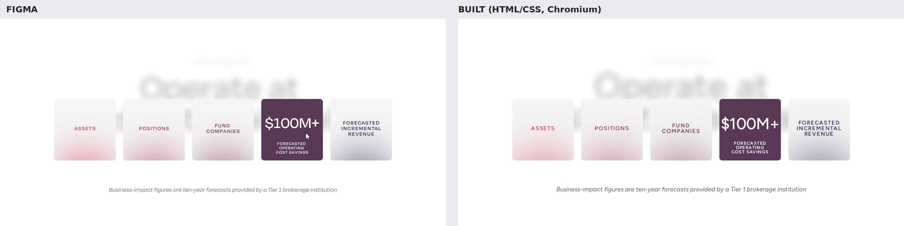
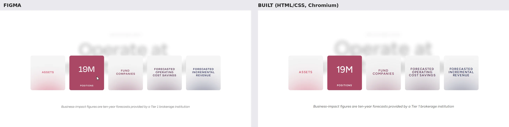

# Figma → code fidelity test

Source: Figma file `0LwfdnxrfQpYSaMd4BZGN0`, page **R3**, frame "Hamsa homepage 2026 8" (`181:947`, 1440 px wide).

## What was built

| Section | Figma nodes | Component |
|---|---|---|
| Global nav | `181:3004` | `src/components/SiteHeader.astro` |
| Hero (y 0–726) | `181:3002`, `181:3003`, `181:3019` (Bird) | `src/components/Hero.astro` |
| Module 5 "Operate at institutional scale" | `181:1013` (states a / b / c) | `src/components/InstitutionalScale.astro` |

All sizes, weights, line heights, letter spacing, colors, radii and offsets come from the Figma API data.
Assets: the logo is exported from Figma as SVG, the bird photo is the original image fill (resized to 2×).

## Behavior inferred from the duplicate states

- **Module 5 a → b**: on scroll the five 199×24 grey bars grow into 199×199 tiles, each with a coloured
  label and a soft glow; the headline blurs (Figma layer blur 25) and fades to 30% behind them; the
  footnote appears. Built as a one-time reveal when 60% of the section is on screen.
- **Module 5 b / c**: the cursor sits on a different tile in each, and that tile is solid with its figure.
  Built as hover (and keyboard focus) state.
- **Nav**: translucent white with background blur, so it is built as a fixed header over the page.

## Known differences

- **Font**: Degular is a paid font. Figtree (free, Google Fonts / Fontsource) is used at the exact Figma
  sizes. It measured the closest of six candidates but is still ~6–8% wider with slightly taller capitals,
  so text appears a little larger and bolder. Line breaks match. Licensing Degular would close most of the gap.
- Blur and glow effects use CSS `filter: blur()` at half the Figma radius; they look very close but not pixel-identical.
- Figma is desktop-only; the mobile/tablet layouts are simple fallbacks, not designed.

## Side-by-side (Figma left, built right, 1440 px)

